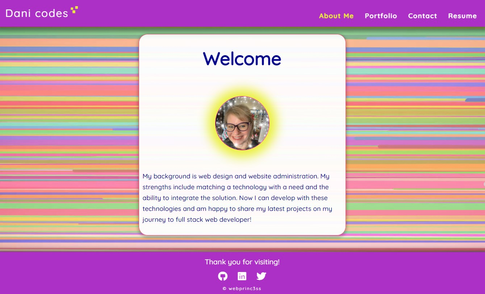

# My React Portfolio

## Table of Contents
  1. [Description](#description)
  2. [Built With](#built-with)
  3. [Website and Github](#website-and-github)
  4. [Questions](#questions)
  
## Description
This project is created with React. It is a one page SPA (single page application) wherein clicking each navigation item triggers a replacement of the main content and a change of the navigation item.  This website is mobile-friendly.

## Built With
- React
- JavaScript
- HTML
- CSS3
   
## Website and Github

[Github Deployment](https://webprinc3ss.github.io/react-portfolio/)

[Github Pages](https://github.com/webprinc3ss/react-portfolio)
 

## Questions
Please feel free to contact me, webprinc3ss at Github: https://github.com/webprinc3ss 

or

djabranton@gmail.com. 
      